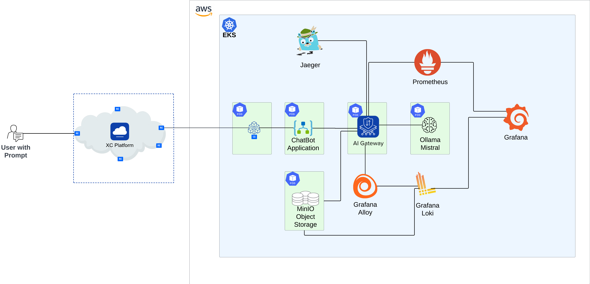
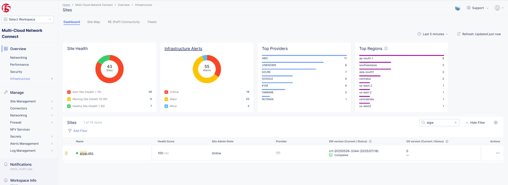
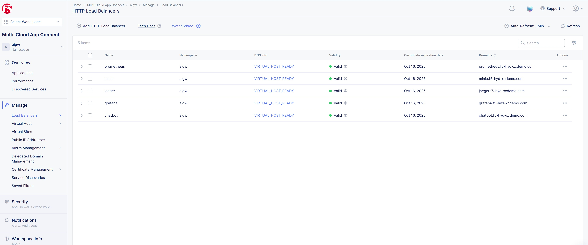
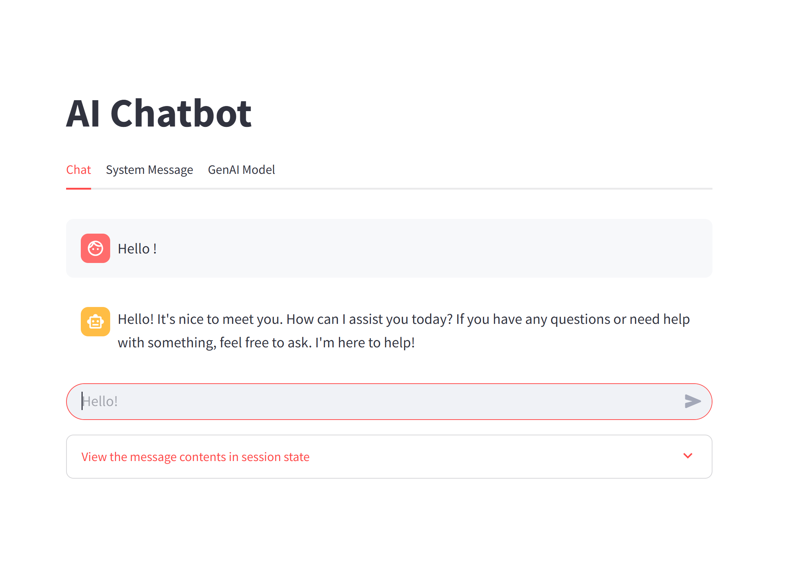

**AIGW deployed on AWS EKS, monitored by Prometheus, Loki, Grafana, Jaeger and MinIO**
###############################################################

Setup Diagram
***************

Prerequisites
***************

* `F5 Distributed Cloud Account (F5XC) <https://console.ves.volterra.io/signup/usage_plan>`_ 
    * `F5XC API certificate <https://docs.cloud.f5.com/docs/how-to/user-mgmt/credentials>`_
    * `User Domain delegated <https://docs.cloud.f5.com/docs/how-to/app-networking/domain-delegation>`_
* `AWS Account <https://aws.amazon.com>`_ - Due to the assets being created, free tier will not work.
  * Please make sure resources like VPC and Elastic IP's are below the threshold limit in that aws region
* `NGINX ONE_License <https://www.f5.com/products/nginx/one>`_ - Access to NGINX ONE license is needed for ai gateway.
* `NGINX PLUS_License <https://docs.nginx.com/nginx/admin-guide/installing-nginx/installing-nginx-plus/>`_ - Access to NGINX PLUS license is needed for ai gateway.
* `OpenAI_API_Key <https://platform.openai.com/api-keys>`_ - Optional but if use case involves OpenAI then api key is needed for ai gateway.

Create a token
-----------------------
- Login to F5 Distributed Cloud, click on `Multi-Cloud-Connect`, navigate to `Site Management` and then to `Site Tokens`

- Create a site token with CE site name `aigw-eks` and copy the ID & name. **NOTE: MAKE SURE TOKEN IS NEWLY CREATED**

- Navigate to `Administration` menu and create a namespace provided in line number 10 in main.tf.

Execution Steps
***************

**STEP 1:** Make sure tools like kubectl, helm, docker, awscli and terraform are installed in your local machine.

**STEP 2:** Export or add your AWS credentials in your local machine. Also if needed please add them to /ai-gateway/values.yaml file from line numbers 195 to 200

**STEP 3:** In main.tf file update values in locals section which contains variables of AWS Infra, F5 XC and NGINX licenses.
Also copy your F5 XC .p12 file to this folder and update line numbers 34 (.p12 file name) and 35 (tenant name) in main.tf.

**STEP 4:** Open /f5_ce_k8s/f5_ce_k8s_config_RBAC.yaml and update cluster name (token name) and token (token value) fields at lines 110 and 121, copied from above `Create a token` section. make sure ce_site_name field in main.tf locals section matches with this token name.

**STEP 5:** Run terraform init, plan and apply to execute the automation code.

**STEP 6:** After 20 mins validate CE site is online in F5 XC and also all load balancers related to this application are online as shown below.

**STEP 7:** Open the chatbot load balancer domain in browser and have some chat conversation. Make sure you are getting the responses correctly as shown below. If you are seeing any openAI errors, check on third tab `GenAI Model` and keep value as empty.

**STEP 8:** In your local machine run ``aws eks update-kubeconfig --name ai-gateway --region us-west-2``, next run ``kubectl get svc -A`` and ``kubectl get secrets -A``. Open the load balancer domain and if asked for credentials copy the value of it's secret credentials password.

**STEP 9:** Validate you can see some transaction details in Observability and other services dashboards. If needed you can also configure your settings in these premetheus, jaeger, loki, etc services.

**STEP 12:** Once everything is validated run ``terraform destroy`` to delete all the resources.
